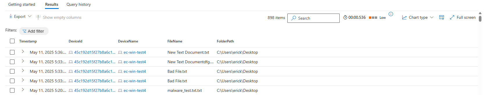
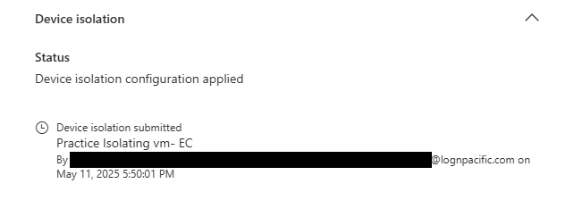
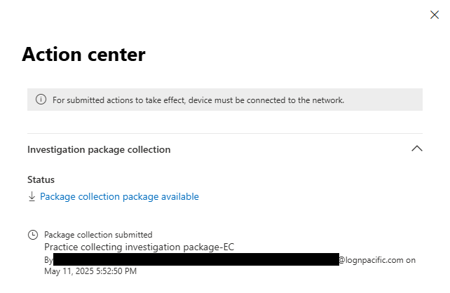
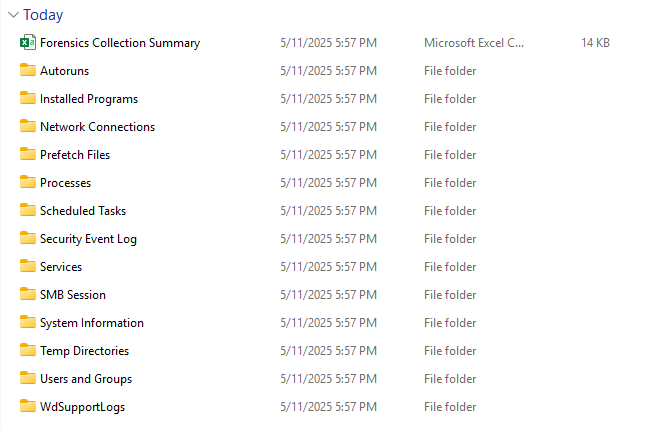
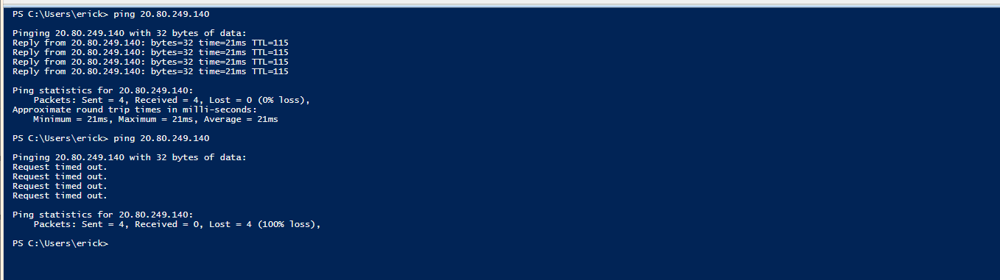
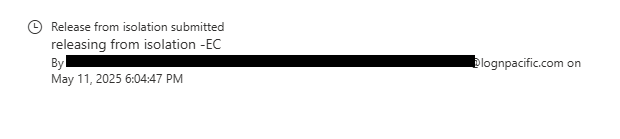
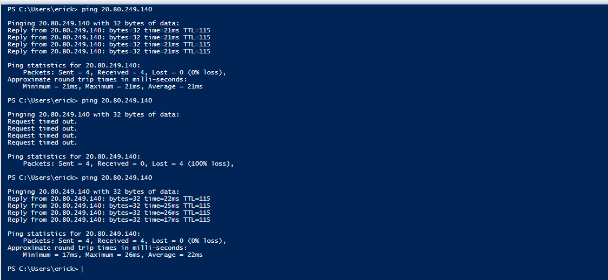

# Device Isolation with Microsoft Defender for Endpoint (MDE)

## Overview

This lab demonstrates how to use Microsoft Defender for Endpoint (MDE) to **detect and respond to a virus alert** on a Windows 10 VM. The process begins with running a KQL query to identify antivirus detections, then proceeds to isolate the device, collect forensic evidence, verify network isolation, and finally release the device from isolation.

---

## Scenario

A suspicious file was detected on a test VM. As part of the incident response process, the security team used MDE to:

1. **Run a KQL query** to identify devices with antivirus detections.
2. **Isolate the VM from the network** to prevent lateral movement or data exfiltration.
3. **Collect an investigation package** for forensic analysis.
4. **Verify network connectivity** before and after isolation.
5. **Release the device from isolation** after the investigation.

---

## Steps and Evidence

### 1. Run KQL Query and Detect Virus Alerts

- The process began by running a KQL query in the MDE portal to review antivirus detection events on the device.
- Virus alerts were observed, indicating suspicious files on the VM.

```kusto
DeviceEvents
| where ActionType == "AntivirusDetection"
| project Timestamp, DeviceId, DeviceName, FileName, FolderPath
| sort by Timestamp desc
```


- Example results showing detected files:



---

### 2. Isolate the Device

- After confirming the virus alerts, the device was isolated using the MDE portal.
- Isolation ensures the device can only communicate with the Defender service, blocking all other inbound/outbound traffic.



---

### 3. Collect Investigation Package

- An investigation package was collected for forensic analysis.
- The package includes logs, running processes, network connections, and more.



- The collected package contains folders such as `Autoruns`, `Network Connections`, `Security Event Log`, and a summary Excel file:



---

### 4. Verify Isolation (Network Test)

- **Before isolation:** The VM could successfully ping an external IP.


- **After isolation:** The VM could no longer reach the external IP, confirming network isolation.



---

### 5. Release Device from Isolation

- After investigation, the device was released from isolation via the MDE portal.



- Network connectivity was restored and verified.



---

## Summary

- **KQL queries** are essential for detecting and reviewing virus alerts in MDE.
- **Device isolation** in MDE is an effective way to contain threats and prevent further compromise.
- **Investigation packages** provide valuable forensic data for incident response.
- **Network tests** confirm the isolation status.

---

## References

- [Microsoft Defender for Endpoint Documentation](https://learn.microsoft.com/en-us/microsoft-365/security/defender-endpoint/)
- [Device Isolation in MDE](https://learn.microsoft.com/en-us/microsoft-365/security/defender-endpoint/respond-machine-alerts)

---

> **Note:** All actions were performed in a controlled lab environment on a non-production VM.

